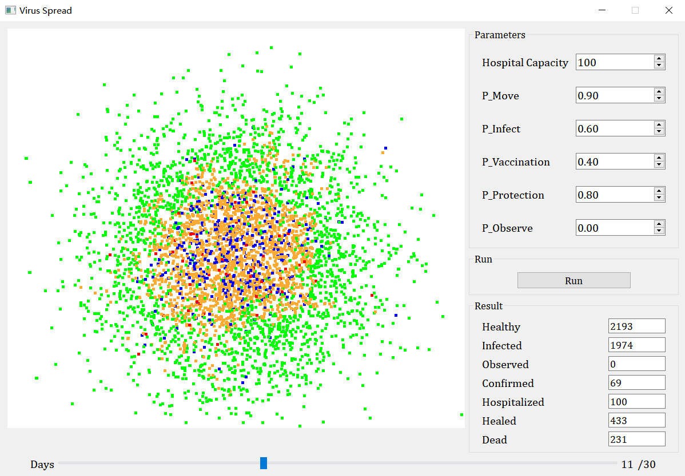

# Virus-Spread

An interactive visualized simulation of virus spread.

## Dependencies

Our visualization script requires pyQt5 and other third-party libraries:

+ numpy\=\=1.20.3
+ pandas\=\=1.2.4
+ PyQt5\=\=5.15.4
+ PyQt5-Qt5\=\=5.15.2
+ PyQt5-sip\=\=12.9.0
+ six\=\=1.16.0

## Run

To run the executable:

```ps1
make all -j4
./bin/main
```

To visualize the simulation:

```ps1
make dll -j4
python3 main.py
```

p.s. The makefile is written for windows MinGW compiler. To compile in other environments, you need to modify it.

### About dynamic library loading

On Windows, when running main.py, you may encounter the following error:

```ps1
FileNotFoundError: Could not find module 'path\to\project\Virus-Spread\bin\sim.dll' (or one of its dependencies). Try using the full path with constructor syntax.
```

This is most likely because the system cannot find the dynamic link library for the C++ standard library that the program needs. In windows system, the dynamic link library path should be put into the environment variable PATH.

To solve this problem, there are two ways. First, put the \bin path of the gcc compiler you are using into the environment variable PATH. Second, put the following dlls from the \bin path of the gcc compiler into the \bin path of your project.

+ libstdc++-6.dll
+ libgcc_s_seh-1.dll
+ libwinpthread-1

The python script responsible for loading the dll ([visual/utils.py](https://github.com/weixr18/Virus-Spread/blob/main/visual/utils.py)) will take the .\bin into the environment variable, so it is valid to do so.

## Structure

+ \\bin: executables and dynamic libraries
+ \\data: simulation results
+ \\document: problem description(in Chinese)
+ \\report: summary of results
+ \\src: C++ codes, implement of simulation program
+ \\visual: python codes, interactive visualization of results

## Example

With the default parameters:

    HOSPITAL_CAPACITY = 100
    P_MOVE = 0.9
    P_INFECT = 0.6
    P_VACCINATION = 0.4
    P_PROTECTION = 0.8
    P_OBSERVE = 0.0

the visualization looks like this


