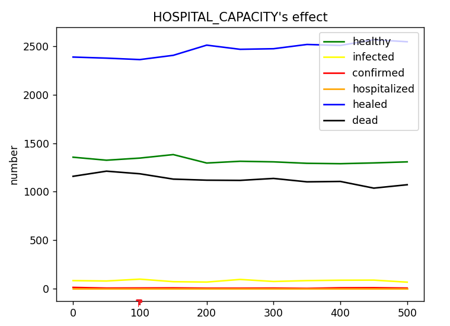

# 第三次仿真实验

## 病毒传播仿真

### 项目结构

+ \\bin: 可执行文件和DLL
+ \\data: 仿真结果数据文件
+ \\report: 报告相关
+ \\src: 仿真主程序代码，C++
+ \\visual: 可视化程序代码，python

### 安装和运行

To run the executable:

```ps1
make all -j4
./bin/main
```

To visualize the simulation:

```ps1
make dll -j4
python3 main.py
```

p.s. The makefile is written for windows MinGW compiler. To compile in other environments, you need to modify it.

#### 关于DLL加载

On Windows, when running main.py, you may encounter the following error:

```ps1
FileNotFoundError: Could not find module 'path\to\project\Virus-Spread\bin\sim.dll' (or one of its dependencies). Try using the full path with constructor syntax.
```

This is most likely because the system cannot find the dynamic link library for the C++ standard library that the program needs. In windows system, the dynamic link library path should be put into the environment variable PATH.

To solve this problem, there are two ways. First, put the \bin path of the gcc compiler you are using into the environment variable PATH. Second, put the following dlls from the \bin path of the gcc compiler into the \bin path of your project.

+ libstdc++-6.dll
+ libgcc_s_seh-1.dll
+ libwinpthread-1.dll

The python script responsible for loading the dll ([visual/utils.py](https://github.com/weixr18/Virus-Spread/blob/main/visual/utils.py)) will take the .\bin into the environment variable, so it is valid to do so.

### 感染模型修改

文档关于健康人到潜伏期感染者的转换的叙述是：


我们认为，文档中的叙述存在问题。判定一个健康人是否感染，应当参照如下的公式：

$$
p_{infect}(person) = 1-(1 - P_{single})^{N_{infectneighbour}(person)}
$$

其中，如果此人未接种疫苗，则$P_{single}$就是病毒感染率$P_{infect}$。如果此人接种了疫苗，则$P_{single}$应当为$P_{infect} \times (1 - P_{protect})$

### 隔离感染者

在必做模块的基础上，我们加入了隔离感染者这一状态。一个感染者，在每一时刻均有$P_{observe}$的概率被发现。被发现后，该患者将不具有传染性。

### 典型传播过程

使用以下参数设定：

```ps1
HOSPITAL_CAPACITY = 100
P_MOVE = 0.9
P_INFECT = 0.6
P_VACCINATION = 0.4
P_PROTECTION = 0.8
P_OBSERVE = 0.0
```

即：医院容量100/5000人，移动意愿0.9，病毒感染概率60%，疫苗接种率40%，疫苗保护率80%，不考虑隔离感染者。这些参数可以认为是，在一个几乎没有隔离意识的小城镇的疫情传播情况。

经过仿真，我们可以得到一个典型的疫情传播过程：


从这个传播过程，我们可以获得如下的信息：

1. 在一个潜伏期（7天）左右，出现大规模确诊患者。由于模型限制，确诊患者几乎会立刻进入医院/自愈/死亡。因此表现为在第7天后治愈者和死亡者大幅上升。
2. 但其实早在第1-2天，就出现了很多被感染者。由于这一段时间是潜伏期，所以看上去无人发病，但其实病毒早就开始了社区的大范围传播。
3. 医疗资源在第7天就用尽了。在移动意愿强烈的情况下，医院对于大量的感染患者而言是杯水车薪。
4. 第20天左右，治愈人数超过了总人数的40%。健康人比例接近于疫苗接种比例。可以认为社区基本已经实现了群体免疫。然而，这种群体免疫是在巨大的死亡人数的代价下实现的，而不是依靠疫苗实现的。

可以看到，仿真得到的结果和我们近1年半以来的经验是很吻合的。

### 参数影响

在典型传播过程的基础上，改变各个参数的值，通过30天时的病毒传播情况，研究各参数对疫情传播的影响。

#### 移动意向


可以看到，移动意向对疫情传播影响非常显著。在典型情况下，只有移动意向下降到0.2以下，才会有效阻值疫情传播。这表明，普通人的居家隔离是十分重要的防疫方法。

#### 病毒感染率


可以看到，病毒感染能力对疫情传播影响也十分显著。并且，只要病毒感染率大于0.4，传播结果就和典型情况相差不大了。这表明，面对病毒我们不能轻敌。即使感染能力不是很强的病毒，如果不对人员的移动进行控制，也很容易造成大规模疫情。

#### 疫苗接种率


可以看到，一方面，接种疫苗是有效的防疫方式。另一方面，对于一个保护能力不错的疫苗(80%)，接种率越高，保持健康的人数就会越多。这表明，应当鼓励居民尽可能地接种疫苗。

#### 疫苗保护率


可以看到，对于接种率并不高的疫苗，只有保护率达到了90%以上，才会使感染情况出现明显好转。这说明，如果疫苗的保护率无法提高，就必须要鼓励大家多接种疫苗，才能提供有效的保护。

#### 医院床位



可以看到，在人群移动意愿很高的情况下，感染人数过多，以至于增加医院容量对疫情好转几乎没有帮助。事实上，我们可以用可视化程序看到，即使医院容量达到500（即平均10人就有一张病床），在人群移动意愿高的情况下，第2-3天的感染者就已经超出了医院的最大承载能力了。医疗资源完全无法承受大量的需求。

#### 感染者隔离


可以看到，如果能即时发现感染病毒的人并把他们隔离，是可以十分有效的控制疫情的。值得注意的是，如果每一时刻的发现概率为5%，则每天一个感染者被发现的概率就达到40%。早发现，早隔离，是十分有效的防疫方法。

### 可视化


运行可视化程序，可以看到这样的界面。在程序中，可以在给定的范围内任意改变参数，研究不同参数下的疫情传播过程。Observed指的是隔离观察的感染者。P_Observe是每个时刻感染者被隔离的概率。
